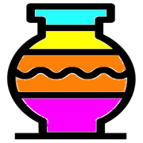
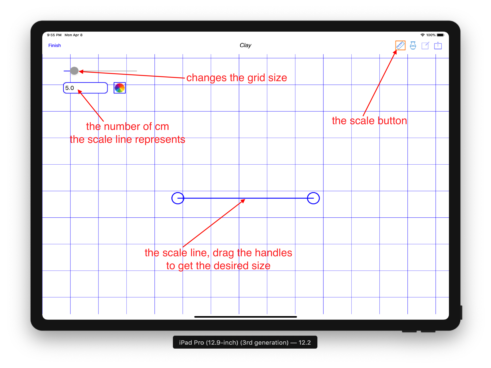
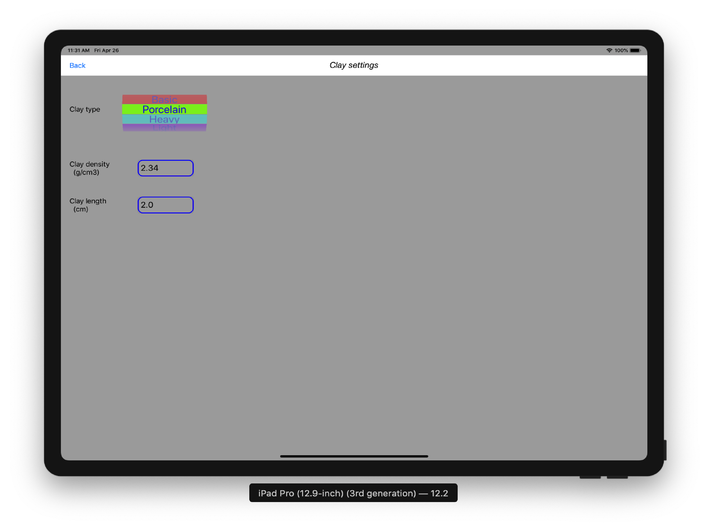
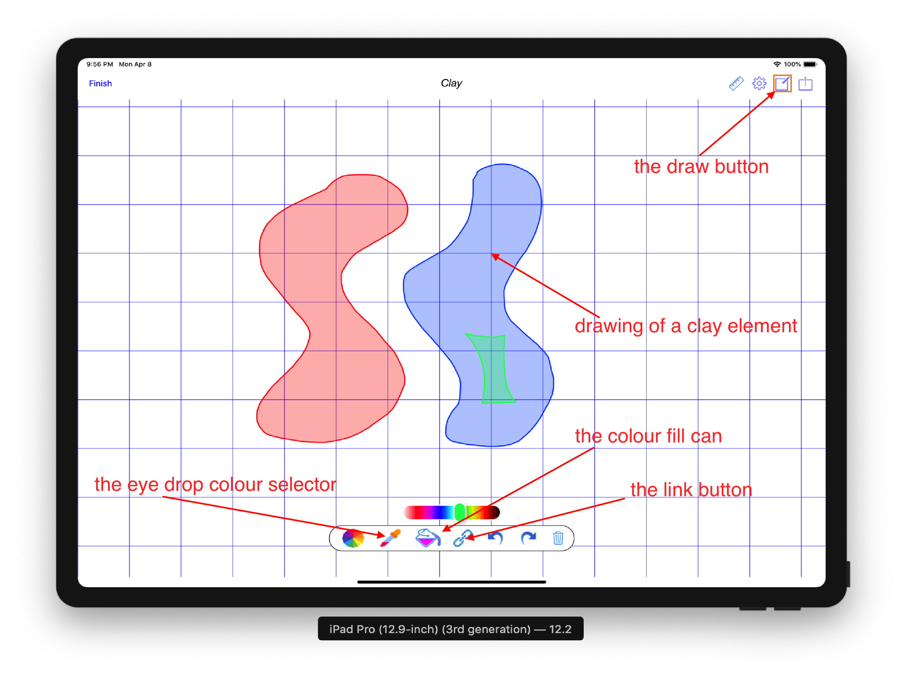
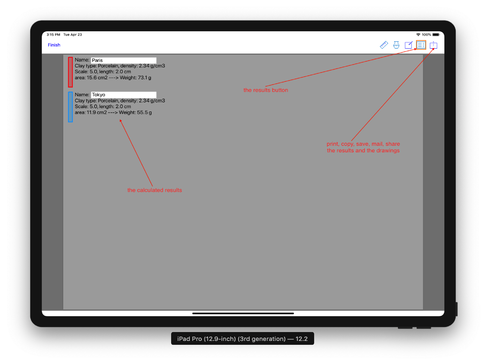

**Nendo Hakari** is is an iPad and iPhone App to calculate the amount of clay you need for your ceramic work. It has a simple interface 
where the user can draw the desired shapes of the various clay components. The tool is mainly for those 
creating ceramic works made of different coloured parts, such as in Nerikomi. **Nendo Hakari** is most 
convenient when used on an iPad using a stylus.

# **Nendo Hakari App**

**Nendo Hakari** for iPads and iPhones is free and is available on the [Apple Store](https://itunes.apple.com/us/app/nendo-hakari/id1458946388?ls=1&mt=8).
         
&nbsp;
&nbsp;
&nbsp;
&nbsp;
&nbsp;

### **Starting**

**Nendo Hakari** first screen asks the user to select the type of background image for the tool. For example, 
using the camera to take a picture of a drawing that will form the background onto which the actual drawing takes place.

##### The choices are: 

- **Camera**, the camera is used to take a photo of an initial drawing that will form the background picture.
- **Photo**, a pre-existing photo is selected as the initial background picture.
- **File**, a previously saved **Nendo Hakari** pdf document that already contains some drawings.
- **Blank**, an empty white background canvas to draw on.

### **Setting the scale**

In order to calculate the results of the various clay parts, a scale must be set. 
The scale setting consists of a screen **scale line** that can be resized by dragging the handles, 
and a value in cm that this **scale line** represents. This value is entered in the **text field** provided.

To help in placing the **scale line** and the drawings a background grid can be displayed and adjusted using the grid slider.

### **Selecting the clay**

Next to the scale button is the **clay pot** icon. Pressing the **clay pot** icon brings up a screen where the type of clay can be selected. 
The clay type, the density of the clay and the length of the work must have some reasonable values 
in order to calculate the amount of clay each part requires.

### **Drawing the shapes**

Pressing the **draw** button displays a canvas on which you can draw the various parts of your clay work.
The different colours represent the different clay types of the work. A colour picker is provided to select the colour you desired.
The results will be aggregated based on the chosen colours. That means all shapes of the same colour 
will be "added together" in the results.

The typical work flow is to first select a colour, then draw the desired shape and press the **link** button 
to close the shape and create the drawing of the clay part. It is important to close the shape with the **link** button.
A **Undo** and **Redo** buttons are provided to assist in the process. It is also important to draw the 
shape in a consistent direction. That is, drawing the shape in a clockwise or anti-clockwise direction, but not a mix of the two.

To draw additional shapes of an existing colour, an **eye drop** colour picker is provided. 
Tap on the **eye drop** icon and it will start pulsating, indicating it is in action. 
Then touch the shape with the colour you want. You can now draw additional shape of the same colour.

To change an existing shape colour, select the colour you want from the colour selector wheel, then 
 tap on the **fill can** icon and it will start pulsating indicating it is in action. 
Then touch the shape you want to fill with your colour. 

### **The results**

Swiping left or pressing the **results** button brings the **results** pages, where the clay information and all calculated values are displayed. 
Each **clay part** is displayed by its colour and is initially given a generic name. Taping on the name 
brings up the keyboard to edit the name.  

The results consist of the clay type and density selected, the scale used and the length thickness of the clay work.
The calculated area of the drawing is shown and finally the calculated weight of the clay for each part is displayed.

The results are aggregated results, that is, parts with the same colour are added together to give you 
the total amount of clay required for that particular colour. 
The results also takes into account subtracting all enclosed parts.

### **Saving the results**

The rightmost button is the **share** button. Pressing this button brings up the typical **share** functions.
From these, you can select printing, copying, mailing, saving and sharing 
the **Nendo Hakari** document as a pdf file. This document includes the drawings and the results pages.

# Nendo Hakari assist

Please address all correspondence regarding the **Nendo Hakari** App to: <nendohakari.assist@gmail.com>

# Privacy Policy
 
The following *Privacy Policy* applies to **Nendo Hakari** App.
 
##### Information Collection, Use, and Sharing
 
**Nendo Hakari** App does not:
 
 * collect, access or record any personal information,
 * collect, access or record any location information,
 * collect, access or record any other information,
 * connect to any server,
 * contain any In-App purchase,
 * display any advertising,
 * ask for credit card number, 
 * ask for login information,
 * lock you into subscription.
   
 We only have access to information that you voluntarily give us via email 
 or other direct contact from you. We will not sell or rent this information to anyone.
 
 We will use your information to respond to you, regarding the reason you contacted us. 
 We will not share your information with any third party outside of our organization, 
 other than as necessary to fulfill your request.
 
 Unless you ask us not to, we may contact you via email in the future to answer your 
 questions regarding the **App** 
 or changes to this privacy policy.
 
##### Your Access to and Control Over Information 
 
You may opt out of any future contacts from us at any time. 
 
If you feel that we are not abiding by this privacy policy, you should contact us 
immediately via email <nendohakari.assist@gmail.com>.
 