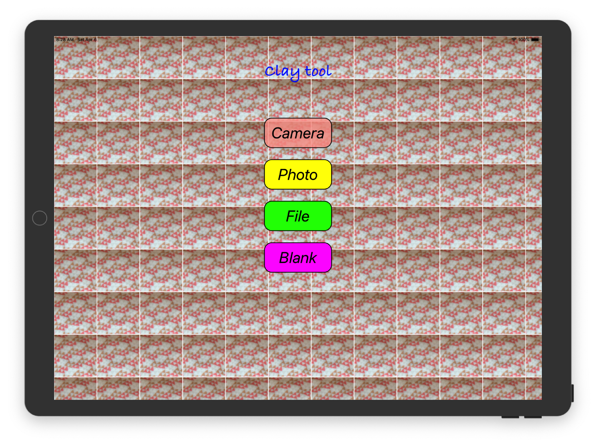
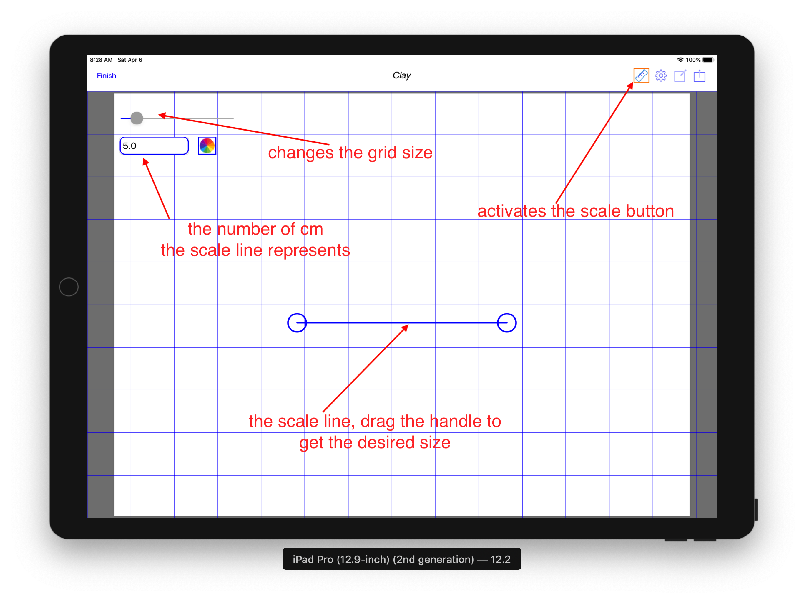
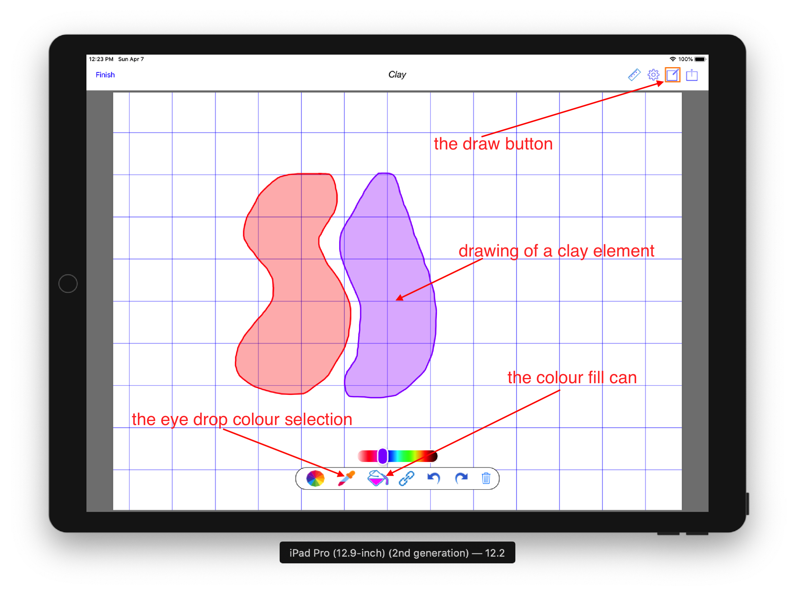
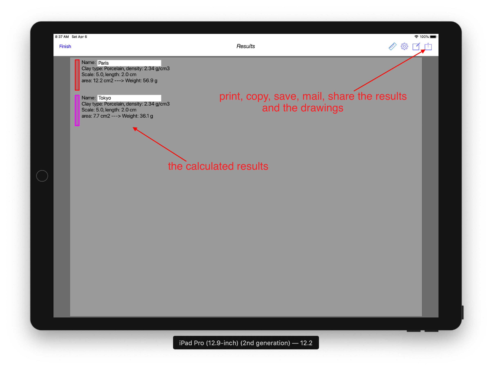
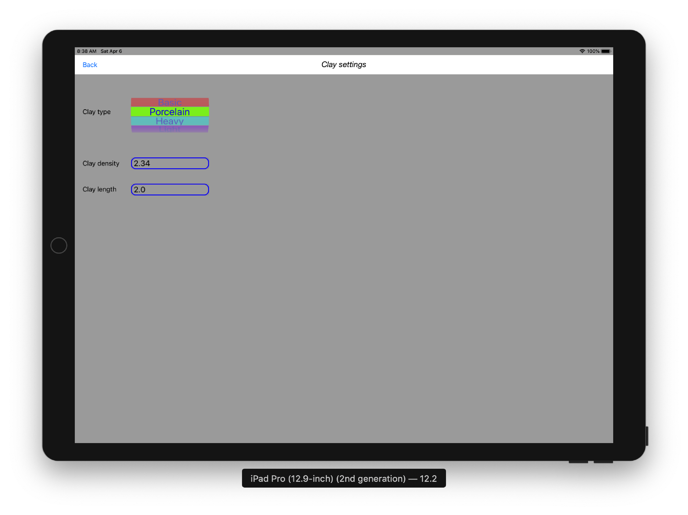

**Nendo Hakari** is a tool to calculate the amount of clay you need for your ceramic work. It has a simple user interface 
where the user can draw the desired shapes of the various clay components. The tool is mainly for those 
creating ceramic works made of different parts, such as in Nerikomi.

# **Nendo Hakari App**

**Nendo Hakari** first screen asks the user to select the type of background image for the tool. For example, 
using the camera to take a picture of a drawing that will form the background onto which the actual drawing takes place.

##### The choices are: 

- **Camera**, the camera is used to take a photo of an initial drawing that will form the background picture.
- **Photo**, a pre-existing photo is selected as the initial background picture.
- **File**, a previously saved **Nendo Hakari** pdf document that already contains the drawings.
- **Blank**, an empty white background canvas to draw on.

### **Setting the scale**

In order to calculate the results of the various drawings/clay parts, a scale must be set. 
The scale setting consists of a screen **scale line** that can be resized using the handles, 
and a value in cm that the **scale line** represents. This valued is entered in the **text field** provided.

To help in placing the **scale line** and the drawings a background grid can be displayed using the grid slider.

Activating the **drawing tool** button displays a canvas on which you can draw the various parts of your clay work.
Each different colours represent a different parts. A colour picker is provided to select the colour you desired.
The results will be aggregated based on the drawing colours.

The typical work flow is to first select a colour, then draw the desired shape and press the **link** button 
to close the shape and create the drawing of the clay part. It is important to close the shape with the **link** button.
A **Undo** and **Redo** buttons are also provided.

Swiping left brings the **results** pages, where all calculated values are displayed. 
Each **clay part** is displayed by its colour and is initially given a generic name. Taping on the name 
brings up the keyboard to edit the name.  

The results consist of the clay type and density selected, the scale used and the length/depth of the clay work.
The calculated area of the drawing is shown and finally the calculated weight of the clay by each part is displayed.

# Nendo Hakari assist

Please address all correspondence regarding the **Nendo Hakari** App to: <nendohakari.assist@gmail.com>

# Privacy Policy
 
The following *Privacy Policy* applies to **Nendo Hakari** App.
 
##### Information Collection, Use, and Sharing
 
**Nendo Hakari** App does not:
 
 * collect, access or record any personal information,
 * collect, access or record any location information,
 * collect, access or record any other information,
 * contain any In-App purchase,
 * display any advertising,
 * ask for credit card number, 
 * ask for login information,
 * lock you into subscription.
   
 We only have access to information that you voluntarily give us via email 
 or other direct contact from you. We will not sell or rent this information to anyone.
 
 We will use your information to respond to you, regarding the reason you contacted us. 
 We will not share your information with any third party outside of our organization, 
 other than as necessary to fulfill your request.
 
 Unless you ask us not to, we may contact you via email in the future to answer your 
 questions regarding the **App** 
 or changes to this privacy policy.
 
##### Your Access to and Control Over Information 
 
You may opt out of any future contacts from us at any time. 
 
If you feel that we are not abiding by this privacy policy, you should contact us 
immediately via email <nendohakari.assist@gmail.com>.
 